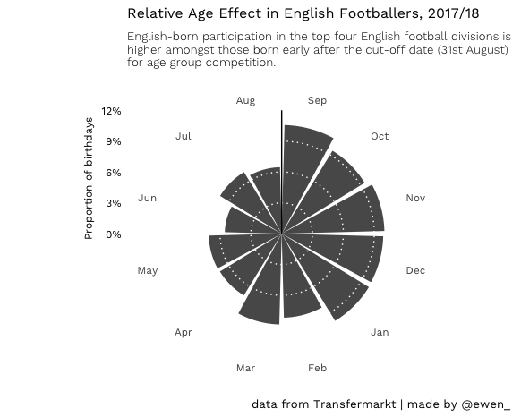

football-squads
================

A dataset (and the code used to get it) about club squads in the following leagues (for the 17/18 season only, at the moment):

-   Premier League (England)
-   Championship (England)
-   League One (England)
-   League Two (England)
-   1.Bundesliga (Germany)
-   LaLiga (Spain)
-   Serie A (Italy)
-   Ligue 1 (France)

Usage
-----

Repo contains:

-   `scrape_squads`, a .R file containing all code used to scrape squad data for the leagues mentioned above.
-   Player-level data in .csv format, found in the /data directory (filenames follow a `<season_start_year>_squads` naming convention)

Data format
-----------

9 variables, as follows:

-   `shirt_number` (shirt number)
-   `position` (preferred position)
-   `name` (full name)
-   `date_of_birth` (date of birth)
-   `age` (age, at time of scrape)
-   `nationality` (primary nationality)
-   `club_name` (club)
-   `league_name` (league)
-   `season` (league season)

Usage
-----

### Relative age effect example

Source
------

All squad data was scraped from [Transfermarkt](https://www.transfermarkt.co.uk/), in accordance with their [terms of use](https://www.transfermarkt.co.uk/intern/anb).
