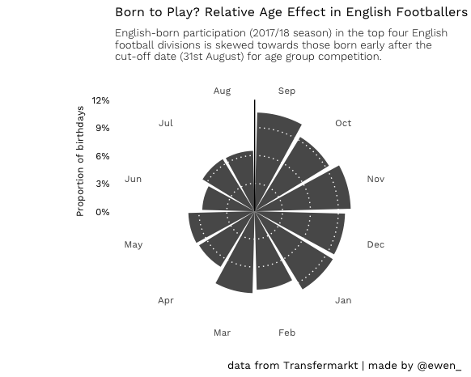

European league football squads’ data
================

## Overview

Demographic data of football (soccer) club playing squads, sourced from
Transfermarkt.

Leagues:

  - Premier League (England)
  - Championship (England)
  - League One (England)
  - League Two (England)
  - 1.Bundesliga (Germany)
  - LaLiga (Spain)
  - Serie A (Italy)
  - Ligue 1 (France)

Seasons:

  - 2017/18
  - 2018/19

## Data

Comes in .csv format, found in `/data` (filenames follow a
`<season>_squads` naming convention).

  - `shirt_number` (shirt no.)
  - `position` (preferred position)
  - `name` (full name)
  - `date_of_birth` (date of birth)
  - `age` (age, at time of scrape)
  - `nationality` (primary nationality)
  - `club_name` (club)
  - `league_name` (league)
  - `season` (season)

## Usage

Relative age effect visualisation:

<!-- -->

## Source

All squad data was scraped from
[Transfermarkt](https://www.transfermarkt.co.uk/), in accordance with
their [terms of use](https://www.transfermarkt.co.uk/intern/anb).
